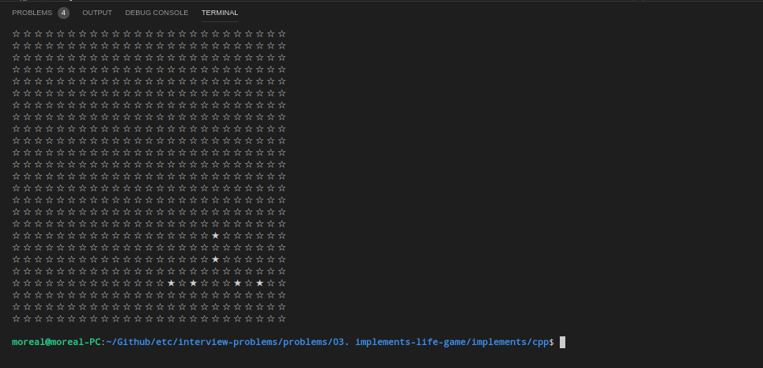

# Implements LifeGame

[](https://app.codacy.com/app/dogeonlove0326/LifeGame-interview-problem?utm_source=github.com&utm_medium=referral&utm_content=moreal/LifeGame-interview-problem&utm_campaign=Badge_Grade_Dashboard)
[](https://travis-ci.com/moreal/interview-problems) 



## Overview

2차원으로 배열된 그리드내에서 각각의 한칸에는 세포가 자리 잡을 수 있습니다.
하나의 세포의 인접한 8방향의 세포에 따라 탄생하고 소멸되는 규칙은 다음과 같습니다.

1. 8 방향중 3개의 세포가 있다면 세포가 탄생
2. 생성되는 세포가 하나도 없다면 게임을 종료
3. 살아있는 세포는 한턴마다 나이를 1 먹습니다.
4. 나이 증가가 완료된 후 주위 세포가 2 또는 3개만 있다면 생존합니다. 그 외의 세포가 있다면 소멸합니다.
5. 생존 규칙에 따라 생존한 세포의 나이가 6보다 크면 소멸

## How to run

```bash
Scripts/build.sh && ./run
```

## Stack (?)

- C++
- CMake
- Travis-CI
- Google Test